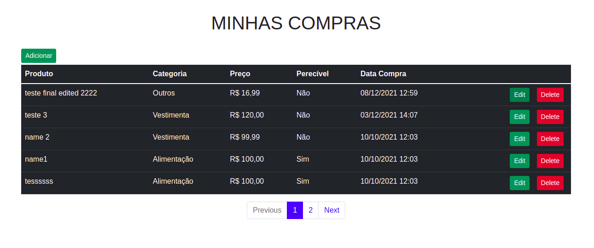
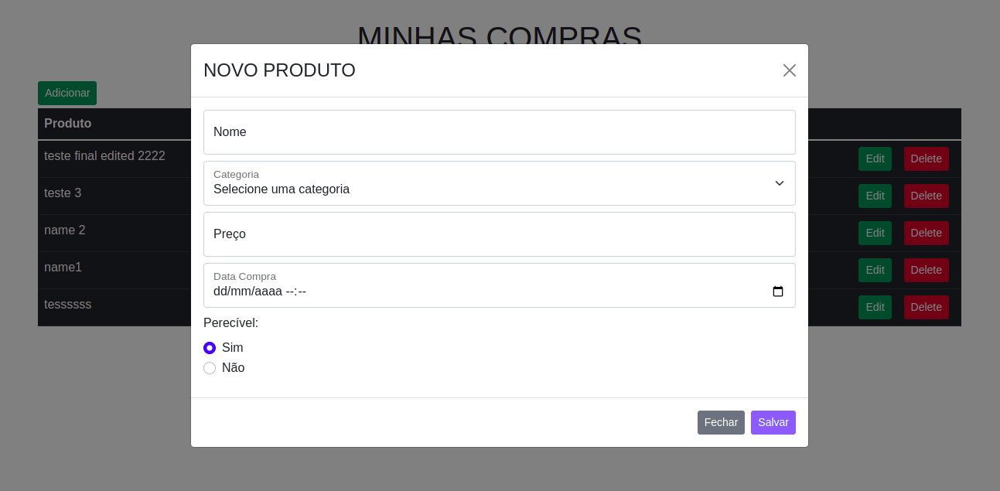
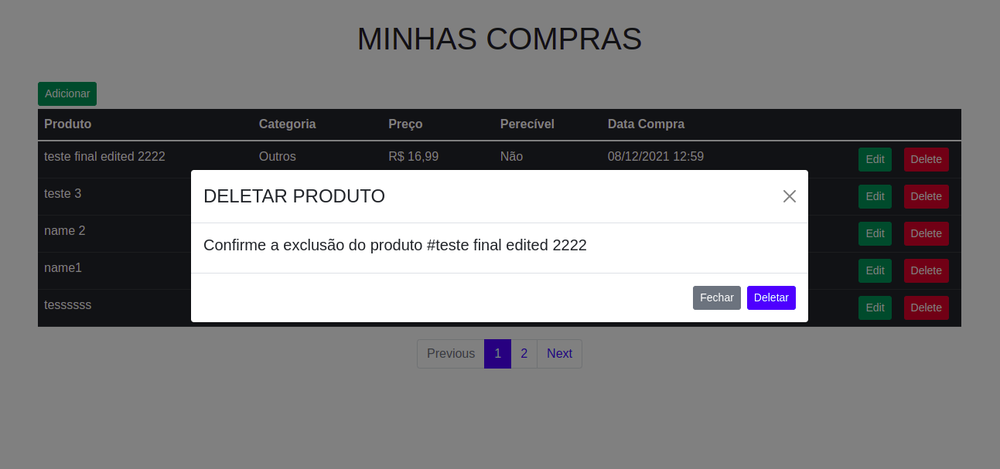

## Crud de lista de compras com React JS, PHP e Mysql

## Processo de instalação e configuração

Requisitos:
- PHP 7.4+
- Node
- Myslq

Instalação Geral:
- Clonar o repositório
- Criar banco de dados, importar(teste_dev.sql)

Instalação Backend:
- cd backend
- Alterar credenciais banco de dados src/config/credentials.ini
- Iniciar servidor (php -S localhost:8000)

Instalação Frontend:
- cd frontend
- alterar url dev environment src/Environment/index.js
- npm install
- npm start

 # listagem
 

# adicionar

# editar

# deletar

